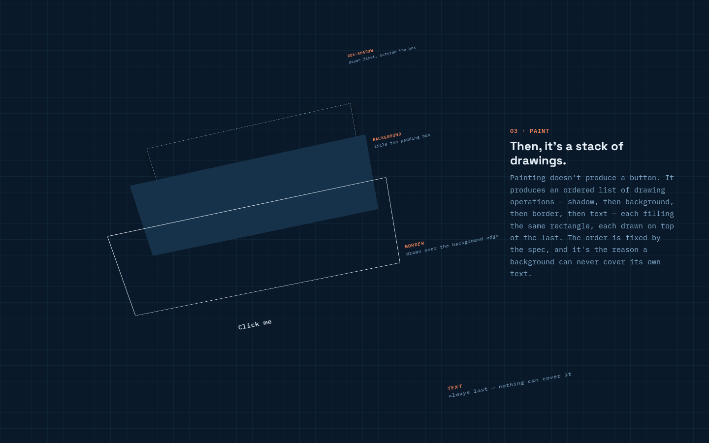

# Cutaway

**▶ Live demo: [apps.charliekrug.com/anatomy-of-a-button](https://apps.charliekrug.com/anatomy-of-a-button/)**

[](https://github.com/ctkrug/anatomy-of-a-button/actions/workflows/ci.yml)
[](LICENSE)

**See the render pipeline inside one button.**

Cutaway takes a single `<button>` and pulls it through the four stages every browser runs to
get it on screen: DOM node, box model, paint order, and GPU layer. Scroll forward and it comes
apart. Scroll back and it reassembles. The button on the page is a real, focusable
`<button>`, and every plane that separates out of it is measured from that same element.



## Use the explainer

1. Open the live demo and scroll to scrub through the pipeline. The sequence follows the exact
   scroll position, so scrolling upward reconstructs the same frames in reverse.
2. Stop at **04 · composite** and switch on **promote to its own GPU layer**. The button texture
   lifts away from the shared document layer while the note explains the memory trade-off.
3. Keep scrolling to reassemble the original button, then read the plain-language stage notes
   below the interactive sequence.

## Who it's for

Front-end developers who write `<button>` every day and have never watched what the browser
does with it. If you know "the box model" as an interview answer rather than as four
rectangles you have seen pull apart, this is the picture that was missing.

## What it shows

- **A node before it's a picture.** The DOM-tree diagram places the button among its parents
  and siblings, which is the only reason a selector like `.toolbar > button` can find it.
- **Four boxes, not one.** Content, padding, border, and margin separate in 3D, so the space
  a button claims reads as visibly bigger than the rectangle it paints.
- **Paint order you can watch.** Box-shadow, background, border, and text float apart in spec
  order, which is why a background can never cover its own text.
- **The promotion trade-off, as a toggle.** Flip the button onto its own GPU layer and compare
  it against the shared document layer, covering both what `will-change` buys you and the
  memory each promoted texture costs.
- **Driven by scroll position, not timers.** The whole sequence is a pure function of scroll
  offset, so it scrubs at exactly your speed and reverses cleanly.

## How it works

The sequence is a pure function. `computeScene(progress)` maps a scroll offset in 0..1 to
every value the diagram needs, and it touches no DOM, so the entire pipeline (including the
guarantee that progress 0 and progress 1 produce identical resting frames) is unit-tested
without a browser. The renderer writes only CSS custom properties, so a scroll frame does no
DOM construction and no layout reads.

Separation is built from envelopes: every tilt and offset is a 0 to n to 0 hump, which is why
the button returns to rest with no reset step.

## Stack

- Vanilla JavaScript (ES modules), no framework, so the render-pipeline metaphor isn't buried
  under a framework's own render pipeline.
- SVG for the DOM-tree diagram. CSS 3D transforms for the box-model, paint, and compositor
  planes, which makes the compositing section genuinely composited rather than a simulation
  of one.
- [Vite](https://vitejs.dev/) for the dev server and the static build.
- [Vitest](https://vitest.dev/) for unit tests, [Playwright](https://playwright.dev/) for
  real-browser geometry checks, [ESLint](https://eslint.org/) for linting.

## Run it locally

```sh
git clone https://github.com/ctkrug/anatomy-of-a-button.git
cd anatomy-of-a-button
npm ci
npm run dev
```

Vite prints the local URL. Open it in a browser, then use the same scroll and promote-toggle
interaction as the live page.

## Quality commands

```sh
npm test          # run the test suite
npm run coverage  # run the suite with a coverage report
npm run test:e2e  # real-browser checks (Playwright) for CSS 3D-transform geometry
npm run lint      # lint the source
npm run build     # produce the static production build
```

## Deployment

`npm run build` produces a self-contained static site in `dist/` using relative asset paths
only, so it hosts at a domain root or in a subpath such as
`apps.charliekrug.com/anatomy-of-a-button` with no backend.

## Docs

- [`docs/VISION.md`](docs/VISION.md): problem, audience, core idea, what "v1 done" means.
- [`docs/DESIGN.md`](docs/DESIGN.md): visual direction, tokens, and layout intent.
- [`docs/ARCHITECTURE.md`](docs/ARCHITECTURE.md): codebase map, module responsibilities, data flow.
- [`docs/BACKLOG.md`](docs/BACKLOG.md): epic and story breakdown for the build.
- [`docs/launch/devto.md`](docs/launch/devto.md): the build write-up.

## License

MIT, see [LICENSE](LICENSE).

More of Charlie's projects → https://apps.charliekrug.com
